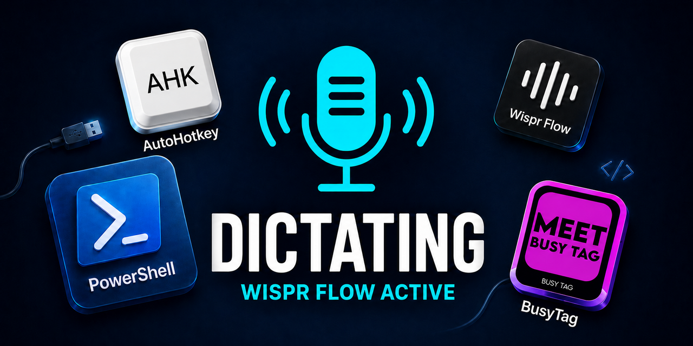

# BusyTag-WisprFlow-Automation

<p align="center">
  
</p>

Open-source Windows automation that connects a Luxafor BusyTag display to Wispr Flow dictation through AutoHotkey, PowerShell, and the BusyTag command-line utility.

## Project story

This project was created to solve a small but frustrating workflow problem: Wispr Flow needed a reliable visual indication while dictation was active, but the available BusyTag, Luxafor, Microsoft Teams, and webhook integrations could not temporarily change the display and then restore whatever image and LED state had been active before it.

The initial vendor-based approaches were useful for normal status management, but they could not reliably support the modifier-only **Ctrl+Windows** press/release behavior or preserve arbitrary device state. The solution evolved into a focused hybrid: AutoHotkey watches the keyboard precisely, while PowerShell communicates directly with the BusyTag, manages the serial-port conflict, saves the prior state, applies the dictation state, and restores it when dictation ends.

The project also grew beyond the hotkey itself. Startup validation, scheduled-task installation, user-local runtime files, CLI provisioning, retry and cancellation handling, device-state verification, and diagnostic output were added so the automation can be installed, reset, tested, and maintained as a reproducible public project rather than as a collection of one-off scripts.

Future improvements may include a more complete installer, version and update management for the BusyTag CLI, broader device and operating-system testing, stronger configuration validation, and additional automated tests for serial communication and cancellation behavior.

## Related terms and keywords

BusyTag Wispr Flow automation; Luxafor BusyTag status light; Windows dictation indicator; Ctrl+Windows hotkey; modifier-only hotkey; key-down and key-up detection; AutoHotkey v2; PowerShell serial-port automation; COM3 device control; BusyTag image upload; LED status restoration; temporary device-state override; Microsoft Teams presence light; Windows logon startup; Windows Task Scheduler; user-local runtime installation; BusyTag CLI; .NET 8 runtime; retry and cancellation handling.

## What it does

When the user holds Ctrl+Windows for Wispr Flow:

1. AutoHotkey detects the modifier-only chord while allowing the original keys to pass through.
2. PowerShell preserves the BusyTag image and LED state.
3. BusyTag/Luxafor desktop processes are closed if they are holding COM3.
4. The dictation image is displayed with cyan LEDs.
5. Releasing either key restores the exact prior image and LED state.

The desktop applications are intentionally not restarted automatically. The user can reopen BusyTag when Microsoft Teams synchronization or manual design selection is needed.

## Technical background

The device uses firmware 2.0, which does not support the older local-server commands found in some documentation. The selected implementation therefore uses direct BusyTag serial commands for state capture, display, LED control, and restoration.

When a vendor application has removed the dictation image from the device, the PowerShell controller detects the missing-image response and uploads the local image as a capped fallback.

## Project layout

```text
BusyTag-WisprFlow-Automation\
├── Config\
│   └── BusyTag.config.json
├── Documentation\
├── Images\
├── Scripts\
│   ├── Runtime\
│   │   ├── BusyTag-WisprFlow.ahk
│   │   └── Set-BusyTagDictationState.ps1
│   ├── Setup\
│   │   ├── Get-BusyTagState.ps1
│   │   ├── Initialize-BusyTagAutomation.ps1
│   │   ├── Install-BusyTagStartupTask.ps1
│   │   └── Test-BusyTagRuntime.ps1
│   └── Startup\
│       ├── Start-BusyTagAutomation-Manual-Launch.bat
│       └── Start-BusyTagAutomation-Scheduled.bat
└── README.md
```

The scheduled-task XML is generated in memory by `Install-BusyTagStartupTask.ps1`; no XML file needs to be launched manually.

## Requirements

- Windows PowerShell 5.1
- AutoHotkey v2
- BusyTag connected on the configured serial port
- .NET 8 runtime for the current BusyTag CLI package
- Internet access during installation so the official BusyTag CLI package can be downloaded
- A local copy of the configured dictation image

## Dependency checklist and references

Use this checklist when preparing a new Windows user profile:

- [ ] Install [AutoHotkey v2](https://www.autohotkey.com/)
- [ ] Confirm [AutoHotkey v2 documentation](https://www.autohotkey.com/docs/v2/)
- [ ] Allow the installer to provision the [BusyTag CLI](https://github.com/busy-tag/busytag-cli)
- [ ] Review [BusyTag CLI releases](https://github.com/busy-tag/busytag-cli/releases)
- [ ] Install the [.NET 8 runtime](https://dotnet.microsoft.com/download/dotnet/8.0)
- [ ] Confirm the [PowerShell documentation](https://learn.microsoft.com/powershell/)
- [ ] Confirm the [Windows Task Scheduler PowerShell reference](https://learn.microsoft.com/powershell/module/scheduledtasks/)
- [ ] Install the [Wispr Flow application](https://wisprflow.ai/)
- [ ] Review the [BusyTag product site](https://busytag.com/)
- [ ] Review the [Luxafor product site](https://luxafor.com/)

The installer downloads and validates the BusyTag CLI under the current user's application data:

```text
%LOCALAPPDATA%\XferWorx\BusyTag-WisprFlow\Runtime\BusyTag.CLI\tools\net8.0\any\busytag-cli.dll
```

The CLI is not committed to this repository. Installation retrieves the official package at install time, keeps it separate from the Git project and log folder, and validates it with the installed .NET 8 runtime. Any redistribution change must preserve the BusyTag CLI package's licensing and dependency requirements.

## Installation and startup

Run the installer from an elevated PowerShell session:

```powershell
Set-Location .\Scripts\Setup
.\Install-BusyTagStartupTask.ps1
```

The installer resolves the current Windows/Entra user SID, removes any existing `XferWorx\BusyTag-Automation` task, dynamically creates the task definition, registers it for interactive logon, and verifies the result.

Before registering the task, the installer downloads BusyTag CLI 0.6.2 into the current user's LocalAppData runtime directory and validates it with the .NET 8 runtime. To test only that provisioning step without changing Task Scheduler, run:

```powershell
.\Install-BusyTagStartupTask.ps1 -ProvisionCliOnly
```

Automatic startup runs:

```text
XferWorx\BusyTag-Automation
```

For a visible manual reset and reload, run:

```text
Scripts\Startup\Start-BusyTagAutomation-Manual-Launch.bat
```

The retention period is user-configurable in `Config\BusyTag.config.json`:

```json
"Runtime": {
  "LogRetentionDays": 14
}
```

Valid values are 1 through 3650 days. If the setting is missing or invalid, the runtime uses 14 days.

## Diagnostics

Read-only runtime diagnostic:

```powershell
.\Scripts\Setup\Test-BusyTagRuntime.ps1
```

Direct BusyTag state query:

```powershell
.\Scripts\Setup\Get-BusyTagState.ps1
```

Runtime log and status-file locations are documented in `Documentation\WisprFlow-Runtime-Notes.md`.

## Safety behavior

- No device storage formatting or unknown-image deletion is performed.
- Prior device state is saved before dictation override.
- Prior state is deleted only after successful restoration.
- Upload retries are capped.
- Startup and upload operations check whether dictation is still requested.
- BusyTag and Luxafor are not silently restarted after dictation.

## Open-source status

This repository is being prepared as a public open-source project. Scripts retain the project header convention, with the repository license and contribution terms to be finalized before publication.
